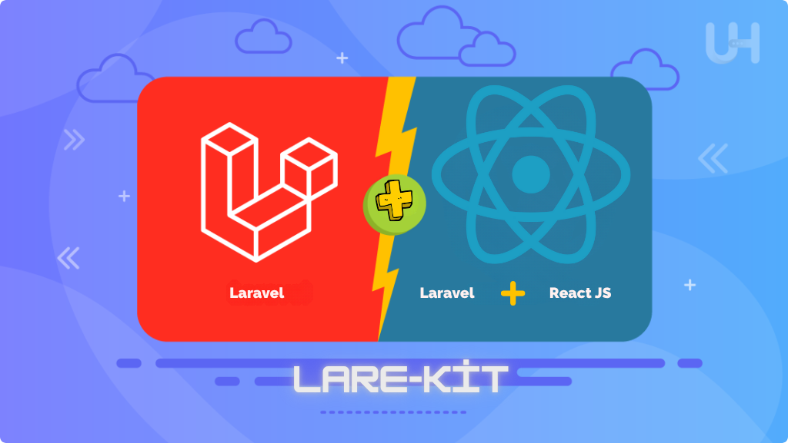

 
     

## What is Lare-Kit?

**Lare-Kit is a modern starter kit that combines the Laravel backend with the React.js frontend using Vite and Tailwind CSS, allowing you to build fast, scalable web applications with clean architecture and excellent developer experience.**

* React handles the UI and UX layer, routing with react-router-dom.

* Laravel supports the backend as a REST API provider with API keys for secure communication.

* Tailwind CSS is pre-configured for styling.

* The setup allows you to write your frontend as a Single Page Application (SPA) while Laravel handles all backend logic and database CRUD operations.

* This kit is ideal for developers who want a ready-to-use full-stack architecture that combines the best of Laravel and React.

# Getting Started Prerequisites
## Make sure you have the following installed:

* PHP >= 8.2.12

* Composer

* Node.js & npm

* MySQL or any other supported database

## Installation Clone the repository:
- [git clone] (https://github.com/AlfaDeveloperr/lare-kit.git)

## To download as an npm package
# npm i lare-kit

## Install frontend dependencies:
# npm install

## Start development servers:
* npm run dev # start Vite + React dev server
* php artisan serve # start Laravel backend server

## Open your browser and visit:
# (http://127.0.0.1:8000)

## Project Structure and Usage
# resources/js/main.jsx — React application entry point.

* resources/views/welcome.blade.php — Laravel blade view that loads React via Vite.

* React components follow the pages/components structure for scalability.

* Tailwind CSS is included via resources/css/app.css.

* API routes and Laravel backend logic are in routes/api.php and controllers.

* route/web.php uses a wildcard route to serve the React app for all frontend URLs, avoiding conflicts with React Router.

## Route::get('/{any}', function () {
## return view('welcome'); // React root blade
## })->where('any', '.*');

## 📦 Recommended Packages Included

| Package | Purpose |
|------------------------------|--------------------------------------------|
| @tailwindcss/vite | Tailwind integration with Vite |
| react, react-dom | React core libraries |
| react-icons | Icon components |
| react-router, react-router-dom | Client-side routing |
| tailwindcss | Utility-first CSS framework |

## Features & Benefits Full stack ready to launch with modern technology stack.

* Works seamlessly with Laravel 10 and React 19+.

* Simplified Vite configuration for React and Tailwind.

* Write clean, maintainable MVC + SPA style applications.

## Features

- UI and SPA support with React
- Powerful and secure backend with Laravel API
- Easy and flexible style management with Tailwind CSS
- Client-side routing with React Router
- URL management from React is seamless thanks to Laravel wildcard routing
- API key-based security
- Easily extensible and maintainable
- and more

## How It Works
* React works as a SPA on the frontend and handles URL redirects internally.

* Laravel backend performs database operations as a REST API.

* API requests are authenticated and secured with an API key.

* UI and UX development is done with React + Tailwind.

**License This project is open source software licensed under the MIT license. **
* cd lare-kit
* php artisan serve
* npm run dev
# You can launch the project by running the following commands

**Credits and Sponsors Thanks to all the Laravel and open source communities that made this possible. Special thanks to lare-kit contributors and sponsors.**